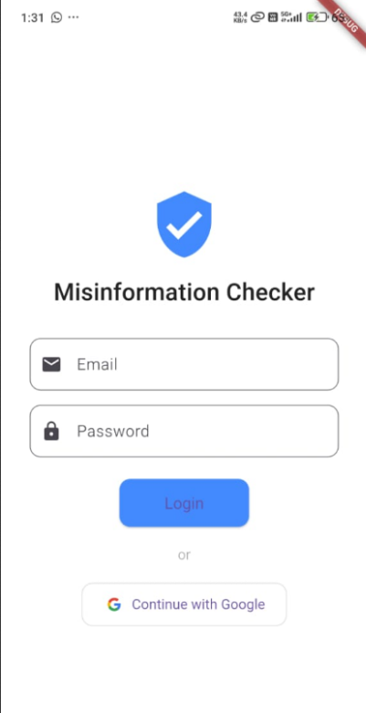
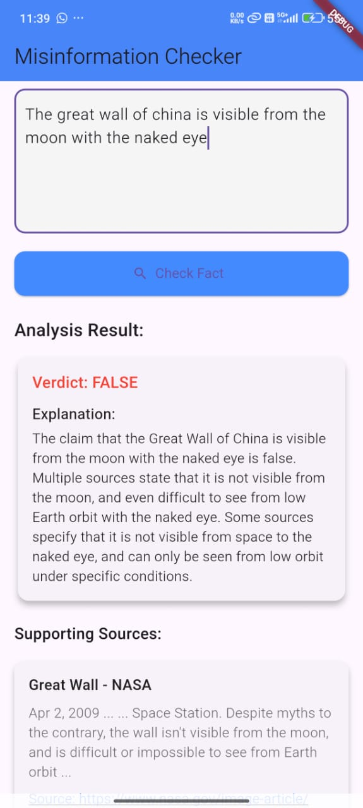
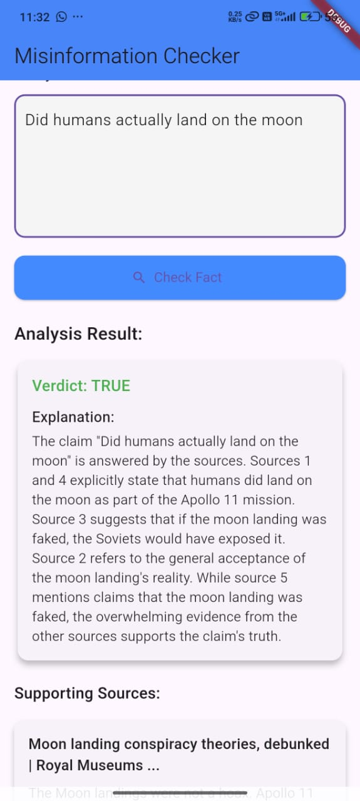
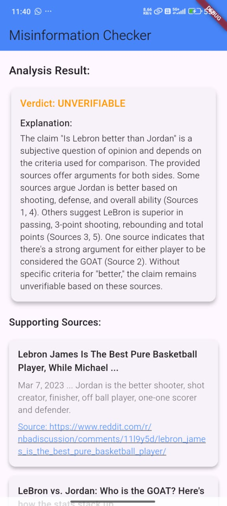

# 🔍 Misinformation Checker App: Your Ultimate Fact-Verification Tool

Misinformation Checker App is your go-to platform for verifying the authenticity of claims and statements. It combines the power of Google Search with AI analysis to help users distinguish between facts and misinformation with ease. Whether you're researching a topic or verifying viral claims, this app provides reliable fact-checking at your fingertips.

## Table of Contents
1. [Project Overview](#project-overview)
2. [Features](#features)
3. [Tech Stack](#tech-stack)
4. [Installation](#installation)
5. [Configuration Details](#configuration-details)
6. [Usage](#usage)
7. [Testing Guidelines](#testing-guidelines)
8. [Troubleshooting](#troubleshooting)
9. [Contributing](#contributing)
10. [License](#license)
11. [Contact](#contact)

## Project Overview

Misinformation Checker App is designed to be a reliable tool for anyone who wants to verify the accuracy of information they encounter online or elsewhere. The platform employs advanced AI analysis alongside trusted data sources to provide objective verification results.

The app focuses on:
- **Claim verification**: Analyze statements to determine their accuracy
- **Source validation**: Pull information from credible sources via Google Search
- **AI-powered analysis**: Utilize Google's Gemini API to reason about the collected information
- **Simple user experience**: Get clear verdicts on claims with minimal effort

The goal of Misinformation Checker App is to promote information literacy and help users make informed decisions based on factual information.

### **App Screenshots**





## Features

- **Claim Submission**: Users can submit any claim or statement they want to verify
- **Automated Research**: The app searches trusted sources via Google Custom Search Engine
- **AI Analysis**: Gemini API analyzes the search results to determine claim validity
- **Clear Verdicts**: Get a straightforward TRUE, FALSE, or UNVERIFIABLE result
- **Source Citation**: Review the sources used to verify each claim
- **User Authentication**: Secure access with Google Sign-In through Firebase Auth
- **Cross-Platform**: Available on multiple devices through Flutter

### Key Features of Misinformation Checker App:
1. **Claim Verification**: Submit any claim and get an objective verdict based on reliable sources
2. **Source Transparency**: See exactly which sources were used in the verification process
3. **AI-Powered Analysis**: Benefit from advanced AI reasoning about the collected information
4. **User-Friendly Interface**: Simple submission and clear results for the best user experience

## Tech Stack

Misinformation Checker App is built with the following technologies:

- **Frontend**:
  - Flutter for cross-platform mobile application
  - Dart programming language
  - Material Design components

- **Backend**:
  - Node.js with Express for API handling
  - Firebase for authentication and hosting

- **APIs & Services**:
  - Google Custom Search Engine (CSE) API for source gathering
  - Google Gemini API for AI-powered analysis
  
- **Development & Testing**:
  - Firebase Emulators for local development
  - Unit and integration testing


## Installation

To run Misinformation Checker App locally on your machine, follow the steps below.

### Prerequisites

Make sure you have the following installed on your system:

- **Flutter SDK** (3.0+ recommended)
- **Node.js** (v16+)
- **Firebase CLI**
- **Google Cloud Platform access** (for API keys)

### Setting up the Project

1. **Clone the repository**:
   ```bash
   git clone https://github.com/your-username/misinformation-checker.git
   cd misinformation-checker
   ```

2. **Install the Flutter dependencies**:
   ```bash
   flutter pub get
   ```

3. **Install the backend dependencies**:
   ```bash
   cd backend
   npm install
   ```

4. **Setup environment variables**:
   - Create a `.env` file in your Flutter project root:
     ```env
     API_URL=http://localhost:PORT/your-endpoint
     ```

   - Create a `.env` file inside the `backend/` directory:
     ```env
     PORT=YOUR_BACKEND_PORT
     CSE_API_KEY=your_google_custom_search_api_key
     CSE_ENGINE_ID=your_search_engine_id
     GEMINI_API_KEY=your_gemini_api_key
     ```

5. **Configure Firebase**:
   - Install Firebase CLI if not already:
     ```bash
     npm install -g firebase-tools
     ```
   - Login to Firebase:
     ```bash
     firebase login
     ```
   - Initialize Firebase in your project:
     ```bash
     firebase init
     ```
     Select Authentication and Hosting options when prompted

6. **Start Firebase emulators**:
   ```bash
   firebase emulators:start
   ```

7. **Run the backend**:
   ```bash
   cd backend
   node index.js
   ```

8. **Run the Flutter app**:
   ```bash
   flutter run
   ```

Now, you should see the application running on your connected device or emulator.

## Configuration Details

### Firebase Configuration

1. **firebase.json Example**:
   ```json
   {
     "hosting": {
       "public": "build/web",
       "ignore": [
         "firebase.json",
         "**/.*",
         "**/node_modules/**"
       ]
     },
     "emulators": {
       "auth": {
         "port": 9099
       },
       "hosting": {
         "port": 5000
       },
       "ui": {
         "enabled": true
       }
     }
   }
   ```

2. **.firebaserc Example**:
   ```json
   {
     "projects": {
       "default": "your-firebase-project-id"
     }
   }
   ```

### Flutter-Firebase Integration

1. **Add Firebase to Android**:
   - Create a Firebase project in the Firebase console
   - Register your Android app with package name (from `android/app/build.gradle`)
   - Download `google-services.json` and place it in the `android/app/` directory
   - Add to your `android/build.gradle`:
     ```gradle
     buildscript {
       dependencies {
         classpath 'com.google.gms:google-services:4.3.15'
       }
     }
     ```
   - Add to your `android/app/build.gradle`:
     ```gradle
     apply plugin: 'com.google.gms.google-services'
     ```

2. **Add Firebase to iOS**:
   - Register your iOS app with bundle ID in Firebase console
   - Download `GoogleService-Info.plist` and add it to your Xcode project
   - In Xcode, make sure the file is included in your app's build target

### Google API Setup

1. **Google Custom Search Engine Setup**:
   - Go to [Google Programmable Search Engine](https://programmablesearchengine.google.com/about/)
   - Create a new search engine
   - Note your Search Engine ID 
   - Configure which sites to search (or select "Search the entire web")

2. **Google CSE API Key**:
   - Go to [Google Cloud Console](https://console.cloud.google.com/)
   - Create a new project or select existing one
   - Enable the "Custom Search API"
   - Create credentials for an API key

3. **Google Gemini API Setup**:
   - Go to [Google AI Studio](https://aistudio.google.com/)
   - Sign up for Gemini API access
   - Generate an API key
   - Configure rate limits and usage thresholds

### Mobile App Configuration

1. **Android Permissions** - Add to `android/app/src/main/AndroidManifest.xml`:
   ```xml
   <uses-permission android:name="android.permission.INTERNET"/>
   ```

2. **iOS Permissions** - Add to `ios/Runner/Info.plist`:
   ```xml
   <key>NSAppTransportSecurity</key>
   <dict>
     <key>NSAllowsArbitraryLoads</key>
     <true/>
   </dict>
   ```

## Usage

Once the app is up and running, users can:

- **Sign in**: Use Google Sign-In to access the app
- **Submit claims**: Enter any claim you want to verify
- **View results**: Get a clear verdict (TRUE, FALSE, or UNVERIFIABLE) for each claim
- **Review sources**: See which sources were used to verify the claim
- **Read explanations**: Understand the reasoning behind each verdict

### Examples of claims to verify:
- "The moon landing was faked"
- "COVID-19 originated from bats"
- "Is the Earth flat?"

### Verification Process
Each verification provides:
- A verdict: **TRUE / FALSE / UNVERIFIABLE**
- An explanation of the reasoning
- Source links from top search results

### App Flow Diagram
```
User Sign-In → Claim Submission → Backend Processing → 
Google CSE Search → Gemini API Analysis → Results Display
```

### Expected Results

For claim "The Earth is round":
- Verdict: **TRUE**
- Sources: Scientific websites, educational resources
- Explanation: Mention of scientific consensus and evidence

For claim "The Earth is flat":
- Verdict: **FALSE**
- Sources: Scientific websites debunking flat Earth theory
- Explanation: References to evidence contradicting the claim

## Troubleshooting

### Common Issues and Solutions

#### Firebase Emulator Issues

1. **Port already in use**
   - **Issue**: "Port 9099 is not available"
   - **Solution**: Kill the process using that port or change it in firebase.json
     ```bash
     sudo lsof -i :9099
     kill -9 [PID]
     ```

2. **Authentication Emulator Connection Issues**
   - **Issue**: App can't connect to Firebase Auth emulator
   - **Solution**: Ensure you're using the emulator in your Flutter code
     ```dart
     if (kDebugMode) {
       await FirebaseAuth.instance.useAuthEmulator('localhost', 9099);
     }
     ```

#### API Connection Issues

1. **CSE API Quota Limits**
   - **Issue**: "Quota exceeded for API key"
   - **Solution**: Check your Google Cloud Console usage, increase quota, or implement caching

2. **Gemini API Response Issues**
   - **Issue**: Inconsistent or unexpected responses
   - **Solution**: Review prompt engineering, ensure proper context is provided to the model

#### Flutter App Issues

1. **Hot Reload Not Working**
   - **Issue**: Changes not reflected after hot reload
   - **Solution**: Try hot restart or check if state is preserved properly

2. **Firebase Auth State Not Persisting**
   - **Issue**: User logged out unexpectedly
   - **Solution**: Ensure Firebase initialization is correct and persistence is enabled

## Contributing

We welcome contributions to make Misinformation Checker App better! To contribute:

1. Fork the repository
2. Create a new branch (`git checkout -b feature/your-feature`)
3. Make your changes
4. Run tests (`flutter test`)
5. Commit your changes (`git commit -am 'Add feature'`)
6. Push to the branch (`git push origin feature/your-feature`)
7. Open a pull request

### Code Style Guidelines

- Follow [Flutter's style guide](https://flutter.dev/docs/development/tools/formatting)
- Use `flutter format .` to format your code
- Run `flutter analyze` to check for issues

## License

MIT License — use freely, contribute wisely.

## Contact

- **GitHub**: [Misinformation Checker App Repository](https://github.com/SujalD04/InfoChecker)
- **Author**: Sujal — Developer
- **Email**: sujalrdixit@gmail.com
